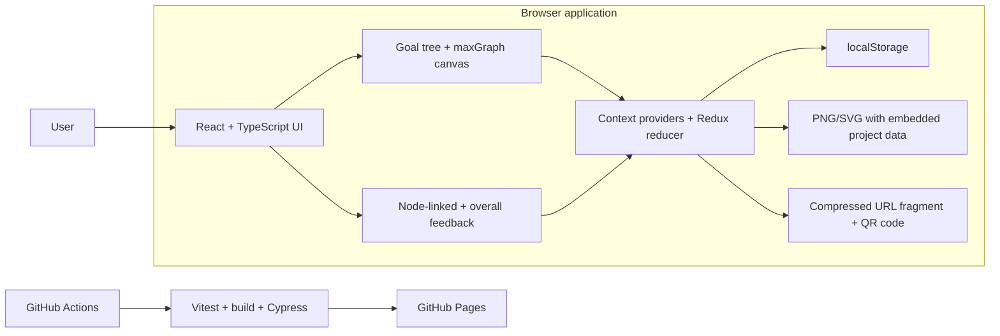

# AMMBER Motivational Model Local Editor

AMMBER is a local-first web application for creating motivational models and collecting feedback on them. It is built with React, TypeScript, Vite, and maxGraph. Projects are stored in the user's browser, so the application does not require a backend service or shared database.

[Open the team deployment](https://lkevincc0.github.io/mm-local-editor/)

For background on the modelling method, see [Motivational Modelling](https://www.leonsterling.com/aboutmotivationalmodelling). A user manual is also available in [`public/papers/AMMBER_User_Manual.pdf`](public/papers/AMMBER_User_Manual.pdf).

## Features

- Create, open, rename, and delete projects in a local project workspace.
- Build and rearrange motivational goal hierarchies and visualise them on a maxGraph canvas.
- Add feedback to individual model elements, reply to comments, and mark discussions as open or resolved.
- Record overall feedback for the complete model.
- Export models as PNG or SVG files with project data embedded for later import.
- Share a project snapshot through a compressed URL or QR code.
- Preserve model structure, project details, and feedback during supported export and import workflows.

## Architecture



The application is intentionally local-first:

- Project data is saved under the current browser profile and site origin.
- Clearing browser site data removes locally stored projects unless they have been exported.
- Exported model files and share URLs can contain project content and feedback; treat them as project data and avoid sharing sensitive information publicly.
- A share link carries a project snapshot in its URL fragment. Large projects may exceed practical QR-code capacity, in which case file export is the safer option.

## Prerequisites

- [Node.js](https://nodejs.org/) `20.19+` or `22.12+`
- npm, which is included with Node.js

[Bun](https://bun.sh/) can be used as an alternative package manager because a `bun.lock` file is included.

Check the installed versions with:

```bash
node --version
npm --version
```

## Local development

Clone the repository and install the locked dependencies:

```bash
git clone https://github.com/lkevincc0/mm-local-editor.git
cd mm-local-editor
npm ci
```

Start the development server:

```bash
npm run dev
```

Open the URL printed by Vite, normally <http://localhost:5173/>.

To use Bun instead:

```bash
bun install
bun run dev
```

## Available commands

| Command | Purpose |
| --- | --- |
| `npm run dev` | Start the Vite development server with hot reload. |
| `npm run build` | Create a production build in `dist/`. |
| `npm run preview` | Preview the production build locally. |
| `npm run lint` | Run ESLint for TypeScript and TSX files with zero warnings allowed. |
| `npm test` | Run Vitest in watch mode during development. |
| `npm test -- --run` | Run the Vitest suite once. |
| `npx cypress open` | Open the Cypress test runner while the development server is running. |
| `npx cypress run` | Run the Cypress end-to-end tests headlessly while the development server is running. |
| `npm run deploy` | Build and publish `dist/` through `gh-pages`; intended for maintainers. |

## Validation before a pull request

Run the following checks before requesting review:

```bash
npm run lint
npm test -- --run
npm run build
```

For the end-to-end suite, keep `npm run dev` running in one terminal and run this in another:

```bash
npx cypress run
```

Unit and component tests are colocated with the source as `*.test.ts` and `*.test.tsx`. Cypress tests are stored in `cypress/e2e/`.

## Continuous integration and deployment

The repository contains GitHub Actions workflows under `.github/workflows/`:

- `ci-cd.yml` runs Vitest, a production build, and Cypress on every push and on pull requests targeting `develop`. A successful push to `develop` is then published to GitHub Pages.
- `deploy.yml` builds and publishes `main` to GitHub Pages.
- `release-version.yml` manages the repository's release-version workflow.

The Vite production output is written to `dist/`. Normal team deployments should go through GitHub Actions; `npm run deploy` is available for authorised manual publication.

## Project structure

```text
src/
  components/          React pages and reusable interface components
    Feedback/          Feedback threads, replies, status, and author UI
    Graphs/            maxGraph canvas and graph controls
    context/           Project, file, graph, feedback, and profile state
    utils/             Import, export, sharing, and other helpers
  data/                Static application data
cypress/e2e/            Browser-level end-to-end tests
public/                 Static assets, papers, and the user manual
.github/workflows/      CI, deployment, and release automation
```

## Contributing

Create a focused feature or fix branch and submit changes through a pull request to `develop`. Keep changes small enough to review, include tests for changed behaviour, and add screenshots for visible UI changes. At least one teammate should review the pull request before it is merged.

More detailed repository conventions are recorded in [`AGENTS.md`](AGENTS.md).
